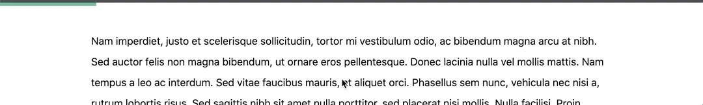

# Vue Snakke

Vue Snakke allows you to add a reading progress bar to your Vue 3 project.



## Install

```
npm install vue-snakke
```

## Usage

Add the following import to your `setup` function:

```javascript
import { useSnakke } from 'vue-snakke';

const { progress } = useSnakke();
```

`progress` is a readonly value (from 0 to 1) that will automatically update whenever the page is scrolled. You can use it to indicate page progress.

## Development

Starting the project for development:

```
npm start
```

### Commands

Run through `npm run [command]`:

- `prettier`: runs Prettier on write mode (overwrites files)
- `prettier:check`: runs Prettier on check mode (useful in CI)
- `build`: builds the example page (used for deployment)
- `build:lib`: builds the library (used for releases)

---

_This project is heavily inspired by [React Snakke](https://github.com/diogomoretti/react-snakke) from [diogomoretti](https://github.com/diogomoretti)._
